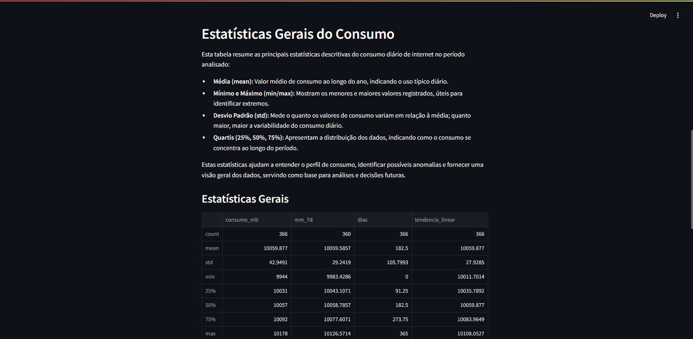
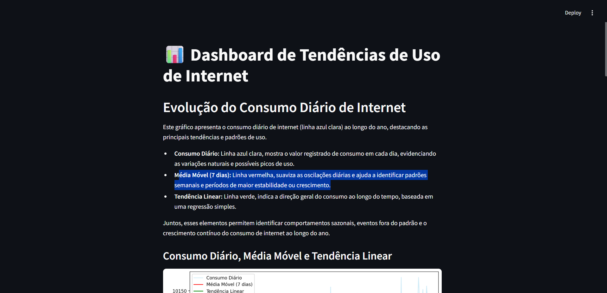

# 📊 Dashboard de Tendências de Uso de Internet

Análise visual, estatística e preditiva do consumo de internet ao longo de um ano, com dashboard interativo em **Streamlit**.



## ✨ Funcionalidades

- Visualização do consumo diário, média móvel e tendência linear
- Estatísticas descritivas e análise de variabilidade
- Projeção linear do consumo para os próximos 30 dias
- Interface web interativa e fácil de usar

## 🚀 Demonstração

<sub>Exemplo visual do dashboard em execução:</sub>



> Sinta-se à vontade para baixar o repositório, rodar localmente e testar!

## ⚙️ Como Rodar

1. Clone o repositório:
   ```bash
   git clone https://github.com/seu-usuario/dashboard-tendencias-internet.git
   cd dashboard-tendencias-internet
   ```
2. Instale as dependências:
   ```bash
   pip install -r requirements.txt
   ```
3. Gere os dados sintéticos (opcional, caso queira atualizar):
   ```bash
   python notebooks/00_gera_dados.py
   ```
4. Execute o dashboard:
   ```bash
   cd app
   streamlit run dashboard.py
   ```

## 🗂️ Estrutura do Projeto

dashboard-tendencias-internet/
│
├── data/            # Base de dados simulada
├── notebooks/       # Notebooks de análise e modelagem
├── app/             # Código do dashboard (Streamlit)
├── imgs/            # Imagens e screenshots para documentação
├── requirements.txt
└── README.md

## 🛠️ Tecnologias Utilizadas:
- Python
- pandas
- scikit-learn
- matplotlib
- Streamlit

## 📈 Sobre o Projeto
Este dashboard simula e analisa o consumo de internet ao longo do tempo, identificando padrões, tendências e realizando previsões. Ideal para portfólio e demonstração de competências em análise de dados, visualização e construção de dashboards interativos.
